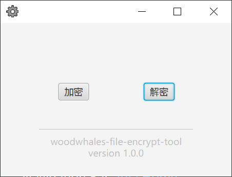

# woodwhales-file-encrypt-tool

> woodwhales-file-encrypt-tool（spring-boot &amp; javafx）
>
> 文件加解密的可视化工具
> 
> 发行版本：https://github.com/woodwhales/woodwhales-file-encrypt-tool/releases

运行环境要求：JDK 1.8 

打包命令：mvn clean install

下载已打包好的 jar 文件，运行命令：java -jar woodwhales-file-encrypt-tool-1.0.0.jar
